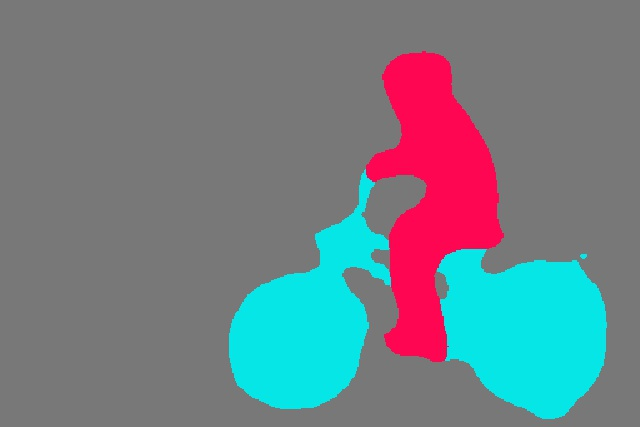

## deploy deep learning model with MNN.

## build
1. install opencv;

2. build MNN

3. build this project

   ```
   mkdir build;cd build
   cmake -DMNN="your MNN path" ..
   make
   ```

## use
### image classification

| model              | source                                                       | demo                                                         | note                             |
| ------------------ | ------------------------------------------------------------ | ------------------------------------------------------------ | -------------------------------- |
| MobileNet V1/V2/V3 | [link](https://github.com/tensorflow/models/tree/master/research/slim) | [src](https://github.com/zhehaoxu/deep-deploy/blob/main/mnn/mobilenet.cc) |                                  |
| EfficientNet       | [link](https://github.com/tensorflow/tpu/tree/master/models/official/efficientnet) | [src](https://github.com/zhehaoxu/deep-deploy/blob/main/mnn/efficientnet.cc) | AdvProp use different preprocess |
| RepVGG             | [link](https://github.com/DingXiaoH/RepVGG)                  | [src](https://github.com/zhehaoxu/deep-deploy/blob/main/mnn/efficientnet.cc) |                                  |

```
./mobilenet mobilenet_v2.mnn cat.jpg
```

Output:

```
class: 282 prob: 0.537347
class: 283 prob: 0.14923
class: 286 prob: 0.127461
class: 288 prob: 0.0312308
class: 284 prob: 0.0156367
```

### object detection

| model   | source                                                   | demo                                                         | note                    |
| ------- | -------------------------------------------------------- | ------------------------------------------------------------ | ----------------------- |
| Yolo V3 | [link](https://github.com/YunYang1994/tensorflow-yolov3) | [src](https://github.com/zhehaoxu/deep-deploy/blob/main/mnn/yolov3.cc) | pass in lastest version |
| Yolo V3 | [link](https://github.com/YunYang1994/tensorflow-yolov3) | [src](https://github.com/zhehaoxu/deep-deploy/blob/main/mnn/yolov3_hc.cc) | decode box by hard code |

```
./yolov3 yolov3.mnn image2.jpg
```

Output:


### image segmentation

| model      | source                                                       | demo                                                         | note |
| ---------- | ------------------------------------------------------------ | ------------------------------------------------------------ | ---- |
| Deeplab V3 | [link](https://github.com/open-mmlab/mmsegmentation/tree/master/configs/deeplabv3) | [src](https://github.com/zhehaoxu/deep-deploy/blob/main/mnn/deeplab.cc) |      |

```
./deeplab deeplab.mnn image1.jpg
```

Output:



### cartoonize/style transfer/paint

| model                | source                                                       | demo                                                         | note |
| -------------------- | ------------------------------------------------------------ | ------------------------------------------------------------ | ---- |
| White Box Cartoonize | [link](https://github.com/SystemErrorWang/White-box-Cartoonization) | [src](https://github.com/zhehaoxu/deep-deploy/blob/main/mnn/white-box-cartoonize.cc) |      |

```shell
./white-box-cartoonize cartoonize.mnn food16.jpg 
```

### super resolution

| model | source                                            | demo                                                         | note |
| ----- | ------------------------------------------------- | ------------------------------------------------------------ | ---- |
| DBPN  | [link](https://github.com/alterzero/DBPN-Pytorch) | [src](https://github.com/zhehaoxu/deep-deploy/blob/main/mnn/dbpn.cc) |      |

```
./dbpn dbpn_x2.mnn butterfly_x2.jpg
```

## tools

1. `frozen_graph.py`: to fix input shape or make partition.